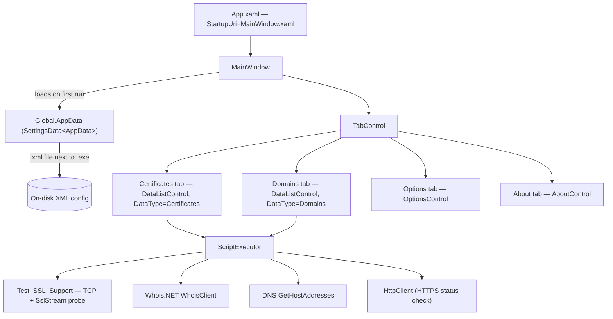
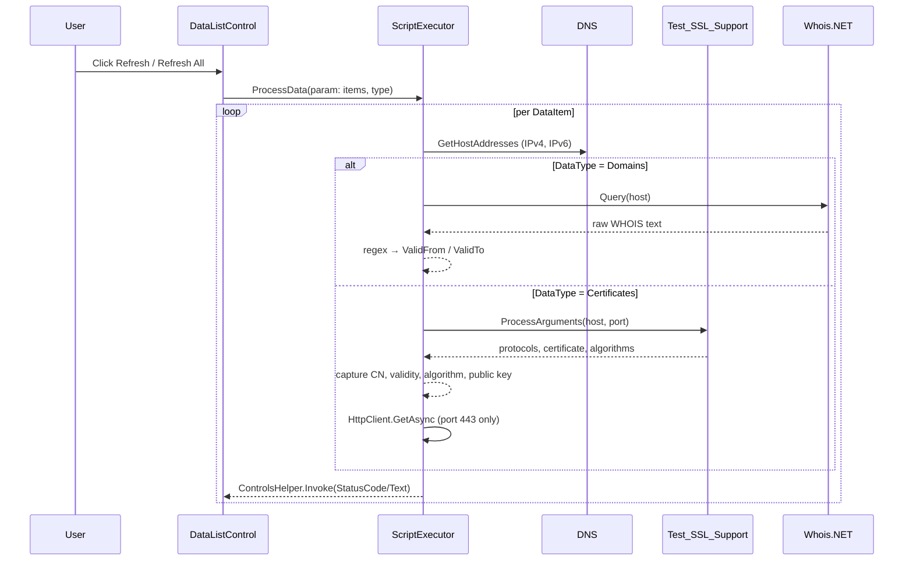
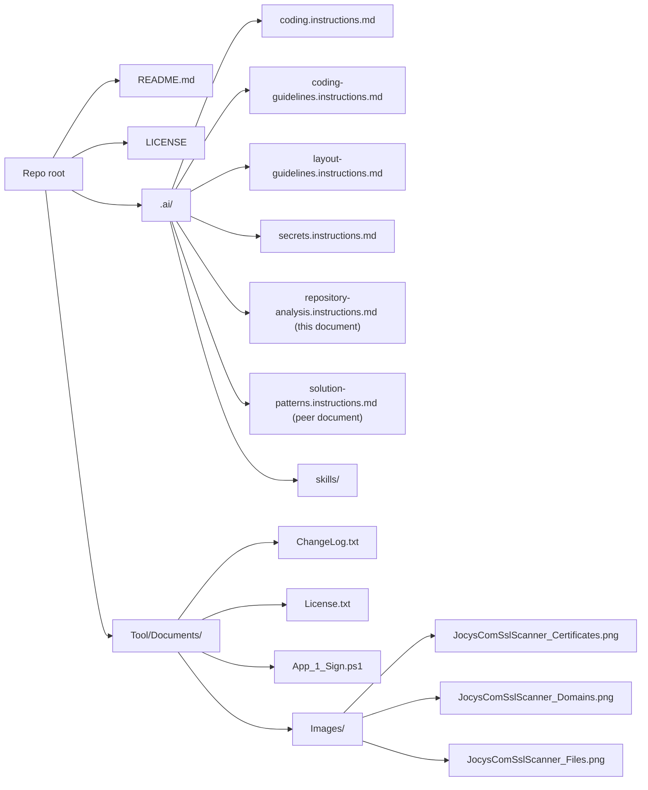
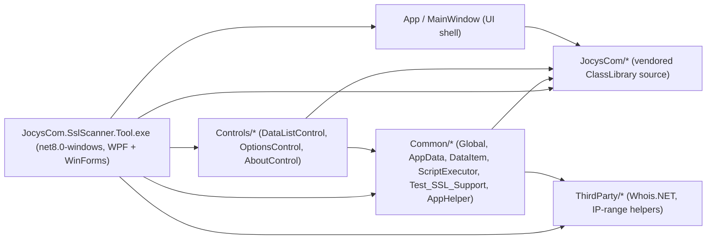

# Repository Analysis — JocysCom SslScanner

This document gives AI coding agents and human contributors a single, factual orientation to the repository: what the product is, how the codebase is laid out, which technologies are in play, how the application is built and published, and where to find the supporting documentation. It is informational; prescriptive guidance lives in the other `.ai/*.instructions.md` files.

## 1. Product overview

The repository ships **Jocys.com SSL Scanner Tool** — a Windows desktop utility that scans SSL/TLS certificates and DNS-domain expiry dates for a curated list of hosts. The tool reads a local XML configuration, queries each entry, and renders the results in a sortable grid. The product is distributed as a digitally-signed single-file `.exe` plus its auto-created XML configuration.

Key capabilities:

- TCP/TLS handshake probing across SSL 3 / TLS 1.0 / 1.1 / 1.2 / 1.3.
- STARTTLS probing for SMTP (TCP:25), POP3 (TCP:110), and IMAP (TCP:143).
- Certificate metadata extraction (CN, validity dates, algorithm, key size, public key).
- WHOIS lookup for domain expiry dates with user-tunable regex parsers.
- DNS resolution (IPv4 + IPv6).
- Optional HTTP response status check for HTTPS endpoints (port 443).
- Import/export of host lists; import from `hosts`-format text.

Primary users are administrators and engineers who need to monitor certificate expiry across many hosts and protocols.

## 2. Repository layout

The repository is a single-project .NET solution. Top-level layout:

```text
SslScanner/
├── .ai/                                   AI instruction bundle (this analysis lives here)
├── .agents/                               Mirror of .ai for non-Claude agent tooling
├── .claude/                               Mirror of .ai for Claude Code
├── .github/                               GitHub configuration
├── .tmp/                                  Local working directory (gitignored under repo conventions)
├── Tool/                                  The single application project
├── Cleanup_Solution.ps1                   Repo-level housekeeping script (removes bin/obj, kills IIS Express, etc.)
├── JocysCom.SslScanner.slnx               Modern .slnx solution file (single project)
├── LICENSE                                GPL v3 license text
└── README.md                              Short product blurb with screenshots
```

Inside the `Tool/` project:

```text
Tool/
├── App.ico                                Application icon embedded in the .exe
├── App.xaml / App.xaml.cs                 WPF app entry point; sets DPI-awareness via P/Invoke
├── AssemblyInfo.cs                        WPF ThemeInfo attribute
├── JocysCom.SslScanner.Tool.csproj        SDK-style project (Microsoft.NET.Sdk, net8.0-windows)
├── MainWindow.xaml / .xaml.cs             Shell window — four tabs (Certificates, Domains, Options, About)
├── Common/                                Application-specific business logic
│   ├── AppData.cs                         Root settings object (Certificates, Domains, WHOIS regexes)
│   ├── AppHelper.cs                       Import-from-hosts helper, DataTable <-> List conversions
│   ├── DataItem.cs                        Per-host record (host/port/IP/cert metadata/status/notes)
│   ├── DataItemType.cs                    Enum: None | Certificates | Domains
│   ├── Global.cs                          Static AppData / AppSettings entry points
│   ├── NativeMethods.cs                   P/Invoke surfaces
│   ├── ScriptExecutor.cs                  Async per-item processor (DNS + WHOIS + SSL probe + HTTP)
│   ├── ScriptExecutorParam.cs             Input bag for ScriptExecutor
│   ├── Test_SSL_Support.cs                Raw TCP + SslStream probing across all SslProtocols values
│   └── Test_SSL_Support.bat               Stand-alone command-line test harness
├── Controls/                              Application-specific WPF UserControls
│   ├── AboutControl.xaml(.cs)             About tab — reads ChangeLog and License embedded resources
│   ├── DataListControl.xaml(.cs)          Certificates/Domains grid; bound by DataType dependency property
│   └── OptionsControl.xaml(.cs)           WHOIS regex configuration UI
├── Documents/                             Embedded resources + shipping documents
│   ├── App_1_Sign.ps1                     Code-signing helper (calls external app_signModule.ps1)
│   ├── ChangeLog.txt                      Embedded resource — release notes
│   ├── License.txt                        Embedded resource — GPL v3 text
│   └── Images/                            README screenshots
├── JocysCom/                              Shared JocysCom.ClassLibrary source linked into the project
│   ├── Collections/  Common/  ComponentModel/  Configuration/  Controls/
│   ├── Controls/Themes/                   Default.xaml, Icons.xaml + SVG icon set
│   ├── Data/  Files/  IO/  Network/  Runtime/  Text/
│   └── MakeLinks_Ref.ps1                  Thin wrapper that delegates to the upstream MakeLinks.ps1
├── Properties/PublishProfiles/            FolderProfile.pubxml (win-x64 single-file) + iOS variant
├── Resources/                             Solution-specific WPF resources
│   ├── BuildDate.txt                      Generated by the PreBuild target on every build (embedded)
│   ├── Icons/                             Local SVG → XAML icon dictionary
│   └── Icons/Icons_Default.SVG_to_XAML.ps1
└── ThirdParty/                            Vendored third-party code
    ├── Bits.cs, IPAddressExtensions.cs, IPAddressRange.cs
    ├── IPv4RangeOperator.cs, IPv6RangeOperator.cs, IRangeOperator.cs, RangeOperatorFactory.cs
    └── WhoisClient.cs, WhoisResponse.cs   Whois.NET implementation
```

The `Tool/JocysCom/` subtree is a curated source-level copy of the [JocysCom.ClassLibrary](https://github.com/JocysCom/ClassLibrary) shared codebase. It is included as compiled source rather than as a NuGet reference so the published single-file binary has no external assembly dependencies.

## 3. Technology stack

| Layer | Technology | Version / notes |
|---|---|---|
| Target framework | `.NET` | `net8.0-windows` |
| UI | WPF | `UseWPF=true` |
| Interop UI | Windows Forms | `UseWindowsForms=true` (interop with classic Forms primitives via ControlsHelper) |
| Output type | Windows executable | `OutputType=WinExe` |
| Application bootstrap | `App.xaml` `StartupUri="MainWindow.xaml"`, DPI-awareness set via `user32!SetProcessDPIAware` in `App()` |
| Build SDK | `Microsoft.NET.Sdk` | SDK-style project, no `packages.config` |
| Solution format | `.slnx` | `JocysCom.SslScanner.slnx` (XML-based solution; single `Tool/...csproj`) |
| External NuGet packages | None declared in the .csproj | All shared code is vendored under `Tool/JocysCom/` and `Tool/ThirdParty/` |
| Embedded resources | `Documents/ChangeLog.txt`, `Documents/License.txt`, `Resources/BuildDate.txt` | All declared in the `<EmbeddedResource>` item group |
| Pre-build step | Inline `PowerShell.exe` Exec | Creates `Resources/` and writes ISO-8601 UTC timestamp into `Resources/BuildDate.txt` on every build (Windows-only) |
| Code signing | `Tool/Documents/App_1_Sign.ps1` | Out-of-tree dependency on `d:\_Backup\Configuration\SSL\Tools\app_signModule.ps1` (not portable; maintainer machine only) |
| License | `PackageLicenseExpression = "GNU General Public License v3.0"` | Full text in `LICENSE` and `Tool/Documents/License.txt` |

## 4. Architecture and key patterns

The application follows a flat single-process WPF MVVM-light architecture: WPF UserControls bound directly to settings objects exposed via a static `Global` accessor. There is no DI container.



Cross-cutting patterns:

1. **Settings persistence** — `JocysCom.ClassLibrary.Configuration.SettingsData<AppData>` reads/writes an XML file whose name matches the running executable (`{baseName}.xml`). On first run `MainWindow` seeds default Certificates (`www.google.com`, `google.com`, `www.bing.com`, `bing.com`, `imap.gmail.com`, `smtp.gmail.com`) and Domains (`google.com`, `bing.com`).
2. **`INotifyPropertyChanged` everywhere** — `AppData` and `DataItem` both implement it via a `SetProperty<T>(ref T, T, [CallerMemberName])` helper. Property changes also raise dependent notifications (e.g. setting `SecurityProtocols` raises `SupportSsl3` / `SupportTls*` change events).
3. **`SortableBindingList<DataItem>`** — sortable observable collection used for both Certificates and Domains; binds directly to the `DataGrid` in `DataListControl`.
4. **Static service locator (`Global`)** — `Global.AppData` is a singleton; `Global.AppSettings` returns the first item inside it (`AppData.Items.FirstOrDefault()`).
5. **Async per-item processing** — `ScriptExecutor.ProcessData` walks each `DataItem` in turn, marshalling status updates back onto the UI thread via `JocysCom.ClassLibrary.Controls.ControlsHelper.Invoke`. Progress is surfaced via `IProgress<ProgressEventArgs>`.
6. **Protocol-agnostic SSL probe** — `Test_SSL_Support` enumerates every value of `System.Security.Authentication.SslProtocols` (except `Default` and `None`), opens a raw TCP socket, optionally upgrades the stream with STARTTLS for SMTP/POP3/IMAP ports, then performs `SslStream.AuthenticateAsClient`. Successful protocols are OR-folded into `DataItem.SecurityProtocols`.
7. **WHOIS via regex** — `ScriptExecutor` parses raw WHOIS text with two regexes configurable in the Options tab. Defaults: `(Creation Date|Registered):\s*(?<Value>[^\s]+)` and `(Expiry Date|Expiration Date|Expires):\s*(?<Value>[^\s]+)`.
8. **DPI awareness** — set in the `App` constructor via P/Invoke before any window is created.



## 5. Project metadata

The solution contains a single project.

### `Tool/JocysCom.SslScanner.Tool.csproj`

| Property | Value |
|---|---|
| AssemblyName (implicit) | `JocysCom.SslScanner.Tool` |
| Description (verbatim) | `Scan SSL/TLS certificate and domain expiry dates.` |
| TargetFramework | `net8.0-windows` |
| OutputType | `WinExe` |
| UseWPF / UseWindowsForms | `true` / `true` |
| Version | `1.1.6` |
| Authors / Company | `Jocys.com` |
| Product | `SSL Scanner Tool` |
| Copyright | `Copyright © Jocys.com 2025` |
| ApplicationIcon | `App.ico` |
| RepositoryUrl | `https://github.com/JocysCom/SslScanner` |
| PackageProjectUrl | `https://www.jocys.com` |
| PackageLicenseExpression | `GNU General Public License v3.0` |
| Debug configuration | `DebugType=embedded`, `DebugSymbols=true` |
| EmbeddedResources | `Documents/ChangeLog.txt`, `Documents/License.txt`, `Resources/BuildDate.txt` |
| PreBuild target | Creates `Resources/` and writes UTC timestamp to `BuildDate.txt` (requires PowerShell on Windows) |

No `Directory.Build.props`, `Directory.Build.targets`, or `Directory.Packages.props` exist. The project is fully self-contained.

### MSBuild variable resolution

No `$(...)` references in the .csproj require resolution from other files. All values are literal except `$(ProjectDir)` (built-in MSBuild reserved property used by the PreBuild Exec command).

## 6. Build, publish, run

### Build

```bash
dotnet restore JocysCom.SslScanner.slnx
dotnet build  JocysCom.SslScanner.slnx -c Release
```

The PreBuild target writes `Tool/Resources/BuildDate.txt` via `PowerShell.exe`. It is Windows-only — Linux/macOS builds will fail at this step unless PowerShell Core is installed and aliased to `PowerShell.exe`, or the target is skipped.

### Publish (single-file Windows release)

`Tool/Properties/PublishProfiles/FolderProfile.pubxml` is the canonical release profile:

| Property | Value |
|---|---|
| Configuration | `Release` |
| Platform | `Any CPU` |
| PublishDir | `bin\Release\publish` |
| PublishProtocol | `FileSystem` |
| TargetFramework | `net8.0-windows` |
| SelfContained | `false` |
| RuntimeIdentifier | `win-x64` |
| PublishSingleFile | `true` |
| PublishReadyToRun | `false` |

Invoke from `Tool/`:

```bash
dotnet publish -c Release -p:PublishProfile=FolderProfile
```

There is a secondary `FolderProfile.iOS.pubxml` profile in the same folder.

### Run

The executable looks for its XML configuration next to itself:

```text
JocysCom.SslScanner.Tool.exe
JocysCom.SslScanner.Tool.xml   ← auto-created on first run with seed data
```

### Code signing

`Tool/Documents/App_1_Sign.ps1` invokes an out-of-tree module `d:\_Backup\Configuration\SSL\Tools\app_signModule.ps1`. This is maintainer-machine-specific and not reproducible outside Jocys.com's signing setup.

### Cleanup

`Cleanup_Solution.ps1` (repo root) removes `bin/`, `obj/`, user-specific solution files, IIS Express state, and other build detritus.

## 7. Tests, CI, and quality gates

| Concern | Status |
|---|---|
| Unit-test projects | **None.** No `*Test*.csproj`, no MSTest/xUnit/NUnit package references, no `[TestClass]` / `[Fact]` / `[Test]` attributes anywhere in the source tree. |
| Integration tests | **None.** |
| `Tool/Common/Test_SSL_Support.cs` / `.bat` | Stand-alone manual test harness, not an automated test project. `Test_SSL_Support.ProcessArguments` is also called at runtime by `ScriptExecutor` to drive real SSL probes. |
| GitHub Actions workflows | **None** at the time of this analysis (`.github/` exists but contains no `workflows/` folder). |
| Static analysis / linters | None configured. Two `#pragma warning disable` blocks suppress obsoletion warnings for `SslProtocols.Default`, `Ssl3`, `Tls`, and `Tls11`. |

If a test project is added later, the standard `dotnet test JocysCom.SslScanner.slnx` invocation will pick it up once it is referenced from the .slnx file.

## 8. Configuration and runtime data

### Persisted settings file

- **Location**: same folder as the executable; filename = `{baseName}.xml` where `baseName` is the executable file name without extension. For the shipped binary that is `JocysCom.SslScanner.Tool.xml`.
- **Format**: XML serialisation of `SettingsData<AppData>` (single item collection wrapping the live `AppData`).
- **Contents**: `Certificates` and `Domains` lists of `DataItem`, plus the two WHOIS regexes.
- **First-run seed**: six certificate entries (`www.google.com:443`, `google.com:443`, `www.bing.com:443`, `bing.com:443`, `imap.gmail.com:993`, `smtp.gmail.com:465`) and two domain entries (`google.com`, `bing.com`) all tagged `Environment=Live`, `Group=Web`.

### `DataItem` field surface (XML schema)

`Environment`, `Group`, `Host`, `IPv4`, `IPv6`, `Port`, `ResponseStatus`, `IsValid`, `PublicKeyData`, `WhoisData`, `Bits`, `SecurityProtocolsValue` (int form of `SslProtocols`), `Algorithm`, `ValidFrom`, `ValidTo`, `ValidDays`, `CN`, `SAN`, `Notes`, `HelpLink`, `Date`, `IsActive`, `StatusCode`, `StatusText`, `IsEnabled`. `IsChecked` and the runtime-only `SupportSsl3/SupportTls/SupportTls11/SupportTls12/SupportTls13` flags are marked `[XmlIgnore]`.

### WHOIS regex defaults

```text
WhoisValidFromRegex = (Creation Date|Registered):\s*(?<Value>[^\s]+)
WhoisValidToRegex   = (Expiry Date|Expiration Date|Expires):\s*(?<Value>[^\s]+)
```

Both are surfaced and editable in the Options tab.

## 9. Documentation taxonomy



| Doc | Purpose |
|---|---|
| `README.md` | One-paragraph product description plus screenshots and a download link to the GitHub release. |
| `LICENSE` | GPL v3 text. |
| `Tool/Documents/ChangeLog.txt` | Release notes (currently lists `v1.0.9` initial release and `v1.1.6` .NET 8 update). Embedded into the .exe. |
| `Tool/Documents/License.txt` | Embedded GPL v3 copy used by the About tab. |
| `Tool/Documents/Images/*.png` | Marketing screenshots referenced from `README.md`. |
| `.ai/*.instructions.md` | AI/contributor instruction bundle (this analysis included). |
| `.ai/skills/` | Bundled project-level skills (`pr-review`, `qa-tester`, `repository-analysis`, `solution-patterns`, `mermaid-rasterize`, `repo-documentation-gatherer`). |

## 10. Development environment requirements

- **Operating system**: Windows 10 / Windows 11 (or Windows Server 2016+). The `net8.0-windows` TFM, the `UseWPF`/`UseWindowsForms` switches, and the PowerShell PreBuild target make this a Windows-only build.
- **.NET SDK**: .NET 8 SDK or newer.
- **IDE**: Visual Studio 2022 (17.8+) or JetBrains Rider 2023.3+ with .NET 8 support. The `.slnx` solution format requires a recent IDE; older Visual Studio versions need the `.slnx` preview enabled or a conversion to `.sln`.
- **PowerShell**: Windows PowerShell 5.1 or PowerShell 7+ for the PreBuild target, `Cleanup_Solution.ps1`, and the signing/MakeLinks helpers.
- **No external services**: there is no database, no message broker, no cloud account required. Network egress to the targets being scanned (TCP to the configured hosts/ports) is the only runtime dependency.

## 11. Dependency map



There are no project-to-project references (single project) and no NuGet package references. Every dependency is satisfied by vendored source files inside `Tool/JocysCom/` (in-house shared library) or `Tool/ThirdParty/` (Whois.NET and an `IPAddressRange` helper).

## 12. Key entry points and call paths

| Concern | Entry point | Where to look |
|---|---|---|
| Application startup | `App()` → `SetDPIAware()` → `MainWindow()` | `Tool/App.xaml.cs`, `Tool/MainWindow.xaml.cs` |
| Settings load / seed | `Global.AppData.Load()` in `MainWindow` ctor | `Tool/MainWindow.xaml.cs`, `Tool/Common/Global.cs`, `Tool/Common/AppData.cs` |
| Settings save | `Window_Closed` → `Global.AppData.Save()` | `Tool/MainWindow.xaml.cs` |
| Certificate scan | `ScriptExecutor.ProcessData` with `DataItemType.Certificates` | `Tool/Common/ScriptExecutor.cs` |
| Domain WHOIS scan | `ScriptExecutor.ProcessData` with `DataItemType.Domains` | `Tool/Common/ScriptExecutor.cs` |
| Raw SSL/TLS probe | `Test_SSL_Support.ProcessArguments(host, port)` | `Tool/Common/Test_SSL_Support.cs` |
| WHOIS regex configuration | `OptionsControl` bindings to `Global.AppSettings.WhoisValidFromRegex` / `WhoisValidToRegex` | `Tool/Controls/OptionsControl.xaml(.cs)`, `Tool/Common/AppData.cs` |
| Host-list import (hosts-file format) | `AppHelper.ImportFromHostsFile` | `Tool/Common/AppHelper.cs` |
| Single-file publish | `FolderProfile.pubxml` | `Tool/Properties/PublishProfiles/FolderProfile.pubxml` |
| Embedded build timestamp | `PreBuild` target → `Resources/BuildDate.txt` | `Tool/JocysCom.SslScanner.Tool.csproj` |

## 13. Known constraints and observations

- **Windows-only by construction**: target framework, P/Invoke `SetProcessDPIAware`, PowerShell PreBuild, WPF + WinForms.
- **No automated tests** in the current tree; only a manual harness (`Test_SSL_Support.cs` + `.bat`).
- **No NuGet dependencies**: every third-party piece is vendored. This simplifies the published artifact at the cost of carrying upstream patches manually.
- **Signing pipeline is non-portable**: `App_1_Sign.ps1` hard-codes the maintainer's local path to the signing module.
- **`Tool/Properties/PublishProfiles/FolderProfile.iOS.pubxml`** exists alongside the canonical Windows profile but the project's TFM (`net8.0-windows`) cannot target iOS without additional configuration; the file is informational only.
- **Suppressed obsoletion warnings** (`SslProtocols.Default`, `Ssl3`, `Tls`, `Tls11`) are intentional — the tool's job is to report on deprecated protocols, so it must still attempt to negotiate them.
- **Solution format is `.slnx`**: the legacy `.sln` is not present. Tooling that does not understand `.slnx` will need to convert it or point at `Tool/JocysCom.SslScanner.Tool.csproj` directly.
