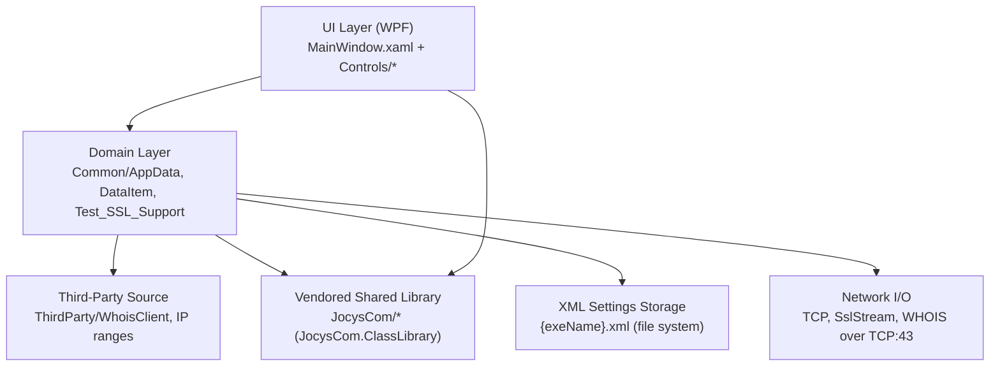
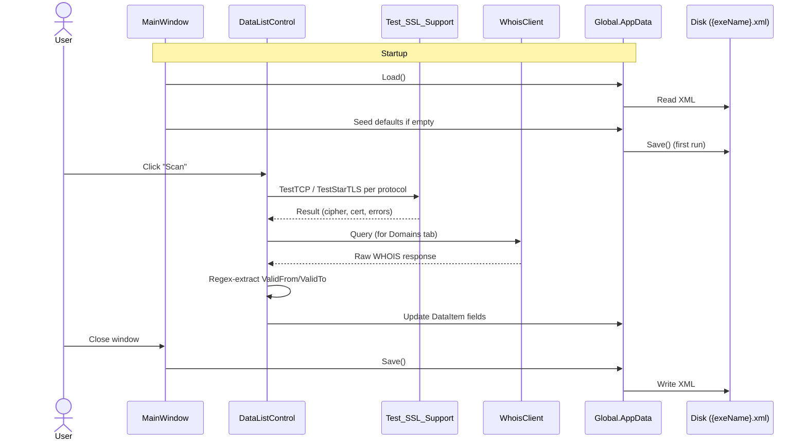
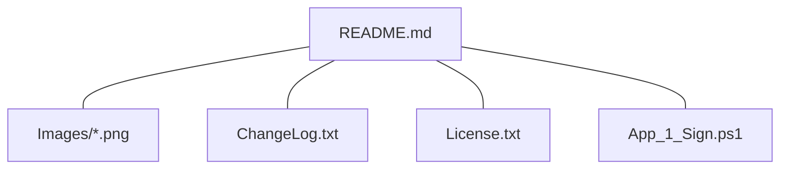

# Repository Analysis — JocysCom.SslScanner

This document is the canonical, factual map of the repository. It is intended as load-bearing context for AI coding agents and human contributors who need to orient quickly: what the product is, where the code lives, what depends on what, and how to build, run, test, publish and release it. It is informational only — it contains no recommendations or prescriptive guidance.

## 1. Product Overview

`JocysCom.SslScanner` is a Windows desktop tool that scans SSL/TLS certificate validity and domain expiry information for a configured list of hosts. The tool supports STARTTLS over SMTP (TCP:25), POP3 (TCP:110) and IMAP (TCP:143) in addition to standard TLS over arbitrary TCP ports (default 443 for HTTPS, 993 for IMAPS, 465 for SMTPS).

Key product facts:

| Item | Value |
|---|---|
| Product name | Jocys.com SSL Scanner Tool |
| Current version | 1.1.6 (2025-05-08) |
| License | GNU General Public License v3.0 |
| Repository | https://github.com/JocysCom/SslScanner |
| Vendor URL | https://www.jocys.com |
| Distribution | Digitally signed single-file Windows executable, downloaded from GitHub Releases |
| Persistence | XML configuration file written next to the executable (`{exeName}.xml`) |

The application is single-user, fat-client and offline-capable; there is no server, no database, and no telemetry. All scanning happens from the user's machine over outbound TCP.

## 2. Top-Level Repository Structure

The repository is intentionally small — a single application project plus shared library sources copied (vendored) under `Tool/JocysCom/`. There are no test projects.

```text
SslScanner/
├── Cleanup_Solution.ps1            PowerShell helper that removes bin/, obj/, IIS Express state and user-specific files
├── JocysCom.SslScanner.slnx        XML-format solution file referencing the single project
├── LICENSE                         GNU GPL v3 (root)
├── README.md                       Short product description + release link + screenshots
└── Tool/                           Application project root (single .csproj)
    ├── App.ico                     Application icon
    ├── App.xaml / App.xaml.cs      WPF application entry; calls SetProcessDPIAware
    ├── AssemblyInfo.cs             Assembly metadata
    ├── JocysCom.SslScanner.Tool.csproj    SDK-style project file (net8.0-windows, WPF + WinForms)
    ├── MainWindow.xaml / .cs       Main window: tab control + first-run seed data
    ├── Common/                     Domain code (DataItem, AppData, Global, scanners, helpers)
    ├── Controls/                   User-facing WPF user controls (Certificates list, Options, About)
    ├── Documents/                  ChangeLog.txt, License.txt, Images/, signing script
    ├── JocysCom/                   Vendored `JocysCom.ClassLibrary` shared source (sub-tree, see §6)
    ├── Properties/                 PublishProfiles/ (Windows + iOS .pubxml)
    ├── Resources/                  Icons/ (XAML resource dictionaries) and runtime-generated BuildDate.txt
    └── ThirdParty/                 Bits.cs, IP-address range types, WhoisClient.cs, WhoisResponse.cs
```

Top-level directory purposes:

| Directory | Purpose |
|---|---|
| `Tool/` | The only application project. Everything that ships is built from here. |
| `Tool/Common/` | Application-specific domain types and helpers. |
| `Tool/Controls/` | WPF `UserControl`s bound by the MainWindow tabs. |
| `Tool/JocysCom/` | Vendored shared library (`JocysCom.ClassLibrary`) source files used as in-project compilation units. |
| `Tool/ThirdParty/` | Third-party source dropped into the project tree (Whois.NET-derived `WhoisClient`, IP-range helpers, `Bits` enum). |
| `Tool/Documents/` | Embedded resources (ChangeLog, License) and release/signing assets. |
| `Tool/Resources/` | Icon resource dictionaries and the build-time generated `BuildDate.txt` embedded resource. |
| `Tool/Properties/PublishProfiles/` | Visual Studio publish profiles for single-file output. |

## 3. Technology Stack

| Layer | Technology | Version / Notes |
|---|---|---|
| Language | C# | Default SDK language version for `net8.0-windows`. |
| Target framework | `net8.0-windows` | TFM declared in `Tool/JocysCom.SslScanner.Tool.csproj`. |
| UI framework | WPF + Windows Forms interop | `UseWPF=true`, `UseWindowsForms=true`. |
| Output type | `WinExe` | Windows GUI executable (no console window). |
| Build SDK | `Microsoft.NET.Sdk` | SDK-style project. |
| Build tool | MSBuild via `dotnet` CLI or Visual Studio | Pre-build PowerShell step writes `Resources/BuildDate.txt`. |
| Solution format | `.slnx` (XML solution) | `JocysCom.SslScanner.slnx`. |
| Packaging | Single-file publish | `PublishSingleFile=true`, `RuntimeIdentifier=win-x64`, `SelfContained=false`. |
| Configuration storage | XML on disk | `SettingsData<AppData>` persists `{exeName}.xml` next to the EXE. |
| Cryptography / TLS | `System.Net.Security.SslStream`, `System.Security.Authentication.SslProtocols`, `X509Certificate2` | Used by `Test_SSL_Support`. |
| WHOIS lookup | In-tree `ThirdParty/WhoisClient.cs` + `WhoisResponse.cs` | Derived from Whois.NET. |
| Logging / telemetry | None | No logging framework, no analytics. |
| External NuGet packages | None | All third-party code is vendored as source (`Tool/JocysCom/`, `Tool/ThirdParty/`). |
| Dependency injection | None | Static `Global` class exposes `AppData` and `AppSettings`. |
| Tests | None present | No `*.Tests.csproj`, no `[TestClass]` / `[Fact]` discovered. |
| Required dev tools | .NET 8 SDK, Visual Studio 2022 (recommended) or `dotnet` CLI, PowerShell (for pre-build step) | Windows-only build (TFM is `net8.0-windows`). |

There is no `Directory.Build.props`, no `Directory.Packages.props`, no `global.json`, and no Central Package Management — all build configuration lives in the single `.csproj`.

## 4. Project Inventory

Only one .NET project is present:

| Project file | AssemblyName | TargetFramework | OutputType | Version | Description (verbatim) |
|---|---|---|---|---|---|
| `Tool/JocysCom.SslScanner.Tool.csproj` | (implicit) `JocysCom.SslScanner.Tool` | `net8.0-windows` | `WinExe` | `1.1.6` | Scan SSL/TLS certificate and domain expiry dates. |

Embedded resources (declared in the same csproj):

- `Documents/ChangeLog.txt`
- `Documents/License.txt`
- `Resources/BuildDate.txt` (generated by the pre-build step)

Content (non-embedded):

- `App.ico`

Pre-build step (verbatim from csproj):

```xml
<Target Name="PreBuild" BeforeTargets="PreBuildEvent">
  <Exec Command="PowerShell.exe -Command &quot;New-Item -ItemType Directory -Force -Path \&quot;$(ProjectDir)Resources\&quot; | Out-Null&quot;&#xD;&#xA;PowerShell.exe -Command &quot;(Get-Date).ToString(\&quot;o\&quot;) | Out-File \&quot;$(ProjectDir)Resources\BuildDate.txt\&quot;&quot;" />
</Target>
```

The pre-build step creates `Tool/Resources/BuildDate.txt` with an ISO 8601 timestamp; this file is then embedded into the assembly as `BuildDate.txt`.

## 5. Application Architecture

The application follows a classic single-process, single-window WPF pattern with a static settings singleton, an XML-serialised settings root (`AppData`), and per-tab `UserControl`s for each functional area.

### 5.1 Layered view



### 5.2 Composition root and settings lifecycle

`Tool/Common/Global.cs` exposes two static members:

- `Global.AppData` — a `JocysCom.ClassLibrary.Configuration.SettingsData<AppData>` instance that owns the on-disk XML and the `Items` collection.
- `Global.AppSettings` — convenience accessor returning `AppData.Items.FirstOrDefault()`, i.e. the first (only) `AppData` instance.

`MainWindow` constructor performs these steps in order:

1. `ControlsHelper.InitInvokeContext()` — initialises the WPF dispatcher helper from the shared library.
2. Computes the XML path from `Process.GetCurrentProcess().MainModule.FileName` and assigns `Global.AppData.XmlFile`.
3. `Global.AppData.Load()` — loads the XML file if present.
4. If `Items` is empty, adds a default `AppData` and saves.
5. If `AppSettings.Certificates` is empty, seeds six certificate entries:
   - `www.google.com:443`, `google.com:443`, `www.bing.com:443`, `bing.com:443`, `imap.gmail.com:993`, `smtp.gmail.com:465` — all with `Environment="Live"`, `Group="Web"`.
6. If `AppSettings.Domains` is empty, seeds two domain entries: `google.com`, `bing.com` — same `Environment="Live"`, `Group="Web"`.
7. `Window_Closed` saves the XML.

### 5.3 Core domain types

`Tool/Common/AppData.cs` — settings root persisted to XML.

| Member | Type | Notes |
|---|---|---|
| `Enabled` | `bool` | `ISettingsItem.IsEnabled` shim. |
| `IsEmpty` | `bool` | True when both collections are empty. |
| `Certificates` | `SortableBindingList<DataItem>` | Lazy-initialised. |
| `Domains` | `SortableBindingList<DataItem>` | Lazy-initialised. |
| `WhoisValidFromRegex` | `string` | Default: `(Creation Date|Registered):\s*(?<Value>[^\s]+)`. |
| `WhoisValidToRegex` | `string` | Default: `(Expiry Date|Expiration Date|Expires):\s*(?<Value>[^\s]+)`. |

Implements `ISettingsItem` and `INotifyPropertyChanged` with `[CallerMemberName]`-driven `SetProperty` / `OnPropertyChanged` helpers.

`Tool/Common/DataItem.cs` — one row of either the Certificates or Domains list.

Fields (each is `INotifyPropertyChanged`-backed unless marked `[XmlIgnore]`):

- Identification: `Environment`, `Group`, `Host`, `IPv4`, `IPv6`, `Port`
- Result: `ResponseStatus`, `IsValid?`, `PublicKeyData`, `WhoisData`
- Crypto: `Bits?`, `SecurityProtocols?` (serialised as `int?` via `SecurityProtocolsValue` because `SslProtocols` contains deprecated members the XML serializer rejects)
- Derived flags (computed): `SupportSsl3?`, `SupportTls?`, `SupportTls11?`, `SupportTls12?`, `SupportTls13?`
- Certificate metadata: `Algorithm`, `ValidFrom`, `ValidTo`, `ValidDays`, `CN`, `SAN`
- Misc: `Notes`, `HelpLink`, `Date`, `IsActive`, `StatusCode`, `StatusText`, `IsChecked` (UI-only `[XmlIgnore]`)

`Tool/Common/DataItemType.cs` — enum with `None=0, Certificates, Domains` used to bind `DataListControl` to either collection.

### 5.4 Scanning logic

`Tool/Common/Test_SSL_Support.cs` implements TLS probing:

- Enumerates all values of `SslProtocols` (excluding `Default` and `None`).
- Per protocol attempts a connection. If the destination port is 25, 110 or 143, `TestStarTLS` is used (issuing the protocol-specific STARTTLS command first); otherwise `TestTCP` connects with `SslStream` directly.
- Captures `ExchangeAlgorithm`, `CipherAlgorithm`, `HashAlgorithm`, key size and any certificate validation errors.
- Results are accumulated into a static `Results` list; progress is reported via the `static Action<string> Progress` callback.

WHOIS lookups are handled by `Tool/ThirdParty/WhoisClient.cs` and `WhoisResponse.cs` — third-party code derived from the Whois.NET library; the `AppData.WhoisValidFromRegex` / `WhoisValidToRegex` strings are then applied to parse expiry dates.

### 5.5 UI structure

`Tool/MainWindow.xaml` defines a top `InfoControl` header (from `JocysCom.ClassLibrary.Controls`) and a `TabControl` with four tabs:

| Tab | Header icon | Control |
|---|---|---|
| Certificates | `Icon_lock` | `DataListControl` with `DataType="Certificates"` |
| Domains | `Icon_environment` | `DataListControl` with `DataType="Domains"` |
| Options | `Icon_gearwheel` | `OptionsControl` |
| About | `Icon_Information` | `AboutControl` |

`DataListControl` is reused for both Certificates and Domains; the bound collection is selected by the `DataType` dependency property (a `DataItemType` enum value).

### 5.6 Module interaction sequence (typical scan)



## 6. Vendored Shared Library (`Tool/JocysCom/`)

The `JocysCom.ClassLibrary` shared library is present as source files inside the application project, not as a NuGet package or `<ProjectReference>`. Its sub-areas as used by this project:

| Subfolder | Used types |
|---|---|
| `Common/` | `Helper`, `ProgressEventArgs`, `ProgressStatus` |
| `Collections/` | `SortableBindingList<T>` (backs `AppData.Certificates` / `AppData.Domains`) |
| `ComponentModel/` | — (utility) |
| `Configuration/` | `SettingsData<T>`, `ISettingsItem`, `AssemblyInfo` |
| `Controls/` | `InfoControl`, `ControlsHelper`, `MessageBoxWindow`, `ProgressBarControl`, themes, helpers |
| `Data/` | — |
| `Files/`, `IO/`, `Runtime/`, `Text/` | — |
| `Network/` | `HostsFileItem` |

`Tool/JocysCom/MakeLinks_Ref.ps1` is a maintenance script (file-link generator). It is not part of the build.

The vendoring strategy means there is no external assembly to keep in sync — updates are propagated by re-copying the shared library files.

## 7. Build, Publish, Cleanup

### 7.1 Build (developer machine)

`Tool/JocysCom.SslScanner.Tool.csproj` is a standard SDK-style project. From a `dotnet`-enabled shell:

```text
# Restore + build
dotnet build Tool/JocysCom.SslScanner.Tool.csproj -c Release

# Build via the .slnx solution
dotnet build JocysCom.SslScanner.slnx -c Release
```

The pre-build target writes `Tool/Resources/BuildDate.txt` via PowerShell; PowerShell must be on PATH on the build host. Because the TFM is `net8.0-windows`, builds and publishes are Windows-only.

### 7.2 Publish (single-file Windows EXE)

Publish profile `Tool/Properties/PublishProfiles/FolderProfile.pubxml`:

```text
Configuration       = Release
Platform            = Any CPU
PublishDir          = bin\Release\publish
PublishProtocol     = FileSystem
TargetFramework     = net8.0-windows
SelfContained       = false
RuntimeIdentifier   = win-x64
PublishSingleFile   = true
PublishReadyToRun   = false
```

Invocation:

```text
dotnet publish Tool/JocysCom.SslScanner.Tool.csproj -c Release -p:PublishProfile=FolderProfile
```

Output: a single executable in `Tool/bin/Release/publish/` (framework-dependent — the target machine needs the matching .NET 8 Desktop Runtime).

A second profile `FolderProfile.iOS.pubxml` exists with `TargetFramework=netcoreapp3.1` and `RuntimeIdentifier=osx-x64` — it predates the upgrade to `net8.0-windows` recorded in the ChangeLog (1.1.6, 2025-05-08) and does not match the current `<TargetFramework>` in the csproj.

### 7.3 Code signing

`Tool/Documents/App_1_Sign.ps1` is the release-time PowerShell script that digitally signs the published executable. The README explicitly markets the application as "Digitally Signed Application v1.1.6".

### 7.4 Workspace cleanup

`Cleanup_Solution.ps1` (root) — PowerShell utility, last modified 2021-09-20, that:

- Kills running IIS Express / dev-server processes.
- Removes `bin/`, `obj/`, IIS Express configuration and user-specific solution files (`*.suo`, `*.user`, etc.).

It is hand-run; nothing in the build references it.

## 8. Testing

No test projects exist in this repository:

- No `*.Tests.csproj`, `*.Test.csproj`, or `*Tests*.csproj` files.
- No test framework references (MSTest, xUnit, NUnit, TUnit).
- No `[TestClass]`, `[Fact]`, `[Test]` attributes in source.
- No `.runsettings` or `.testsettings` files.

`Tool/Common/Test_SSL_Support.bat` and `Tool/Common/Test_SSL_Support.cs` are not unit tests — they are the production TLS-probing implementation (and a developer batch file that invokes it).

`dotnet test` against `JocysCom.SslScanner.slnx` will report zero test projects discovered.

## 9. Configuration and Runtime State

The application writes one XML file alongside the executable:

- Filename: `{ExecutableFileNameWithoutExtension}.xml` (e.g. `JocysCom.SslScanner.Tool.xml`).
- Location: the directory containing the running `.exe`.
- Content: XML-serialised `SettingsData<AppData>` — see §5.3 for the schema.
- Lifecycle: loaded on `MainWindow` construction, saved on `Window_Closed`.

There are no environment variables, no command-line arguments, no in-app feature flags. WHOIS regex patterns are user-editable through the Options tab and persisted in the same XML.

## 10. Documentation Tree

Documentation lives entirely under `Tool/Documents/` and the root `README.md`:

```text
Tool/Documents/
├── App_1_Sign.ps1                 Release signing script
├── ChangeLog.txt                  Embedded; updated each release
├── License.txt                    Embedded; GPL v3 text
└── Images/
    ├── JocysComSslScanner_Certificates.png    README screenshot
    ├── JocysComSslScanner_Domains.png         README screenshot
    └── JocysComSslScanner_Files.png           README screenshot
```



`README.md` is intentionally minimal: product description, download link, screenshots. There is no contributor guide, no architecture document, no design notes.

## 11. Continuous Integration / Continuous Delivery

There is no CI configuration in the repository:

- No `.github/workflows/` directory was present prior to the AI-onboarding bundle.
- No Azure DevOps pipelines.
- No `.gitlab-ci.yml`.

Releases are produced manually on a developer workstation using `dotnet publish` + `App_1_Sign.ps1`, and uploaded as GitHub Release assets (the README links to the 1.1.6 release zip).

## 12. Dependencies (External)

The single project file declares **no** `<PackageReference>` and **no** `<ProjectReference>`. All non-BCL functionality is satisfied by:

- Vendored shared-library source under `Tool/JocysCom/`.
- Vendored third-party source under `Tool/ThirdParty/` (Whois.NET-derived).
- .NET 8 Base Class Library, WPF and WinForms (provided by the `net8.0-windows` desktop runtime).
- `user32.dll!SetProcessDPIAware` via P/Invoke (declared inline in `App.xaml.cs`).

Consequence: there is no NuGet restore graph to keep clean, no transitive vulnerabilities to triage, and no central package versioning.

## 13. Source Inventory Snapshot

The following counts are factual at the time of analysis (excluding `bin/`, `obj/`, `.git/`, `.tmp/`, `.ai/`, `.claude/`, `.agents/`, `.roo/`, `.kilo/`, `.clinerules/`, `.github/`):

| Area | Files |
|---|---|
| Root `.cs` (application) | `App.xaml.cs`, `AssemblyInfo.cs`, `MainWindow.xaml.cs` |
| `Tool/Common/` `.cs` | `AppData.cs`, `AppHelper.cs`, `DataItem.cs`, `DataItemType.cs`, `Global.cs`, `NativeMethods.cs`, `ScriptExecutor.cs`, `ScriptExecutorParam.cs`, `Test_SSL_Support.cs` (+ `Test_SSL_Support.bat`) |
| `Tool/Controls/` | `AboutControl.xaml(.cs)`, `DataListControl.xaml(.cs)`, `OptionsControl.xaml(.cs)` |
| `Tool/ThirdParty/` `.cs` | `Bits.cs`, `IPAddressExtensions.cs`, `IPAddressRange.cs`, `IPv4RangeOperator.cs`, `IPv6RangeOperator.cs`, `IRangeOperator.cs`, `RangeOperatorFactory.cs`, `WhoisClient.cs`, `WhoisResponse.cs` |
| `Tool/JocysCom/` | Vendored `JocysCom.ClassLibrary` subtree (see §6) |
| `Tool/Resources/Icons/` | XAML resource dictionaries referenced by `MainWindow.xaml` (`Icon_lock`, `Icon_environment`, `Icon_environment_network`, `Icon_gearwheel`, `Icon_Information`) |
| `Tool/Properties/PublishProfiles/` | `FolderProfile.pubxml`, `FolderProfile.iOS.pubxml` |
| `Tool/Documents/` | See §10. |

## 14. Cross-references

- See §3 for technology versions and §7 for the build commands that use them.
- See §5 for the runtime composition and §9 for the runtime state it produces.
- See §11 for the (absent) CI story; releases are described in §7.3.
