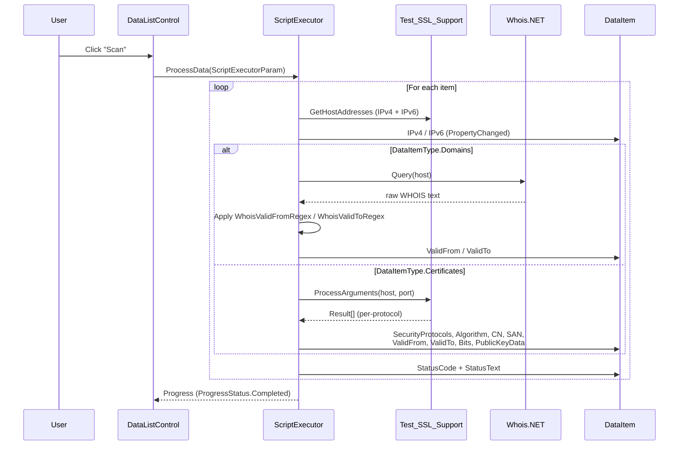
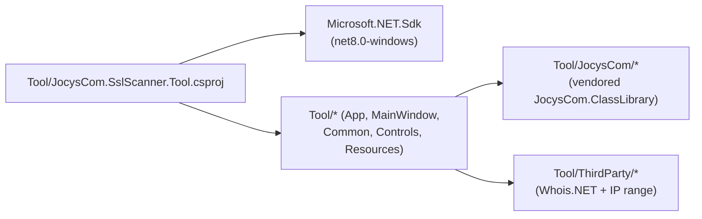
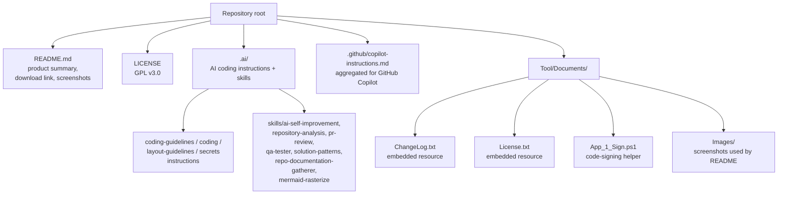

# JocysCom.SslScanner — Repository Analysis

> Comprehensive map of the SslScanner repository: solution layout, technology stack, architecture, runtime behaviour, build/publish/test workflow, and documentation taxonomy. Generated by the `repository-analysis` skill against the working tree at the time of this file's write.

## Purpose

SSL Scanner Tool is a Windows desktop utility (.NET 8) that scans SSL/TLS certificate validity for a curated list of hosts and tracks domain WHOIS expiry dates. The certificate scanner supports STARTTLS upgrade for SMTP (TCP/25), POP3 (TCP/110), and IMAP (TCP/143) in addition to direct TLS endpoints (e.g. HTTPS/443, IMAPS/993, SMTPS/465). All state — host list, scan results, options, regex patterns — is stored in a single XML file next to the executable.

## Solution Structure

The solution is intentionally minimal: one project under one solution file. The Tool project owns both the WPF UI shell and the scanning engine.

```
/                                       Repository root
├── JocysCom.SslScanner.slnx            Solution file (XML-slnx format) — references Tool only
├── README.md                           Product summary + download link + screenshots
├── LICENSE                             GPL v3.0 (35 KB)
├── Cleanup_Solution.ps1                Removes bin/, obj/, .vs/ across the tree
├── .gitignore                          Standard .NET / Visual Studio ignores
├── .github/
│   └── copilot-instructions.md         Aggregated AI coding instructions (generated)
└── Tool/                               Single executable project
    ├── JocysCom.SslScanner.Tool.csproj net8.0-windows, WPF + WinForms, WinExe
    ├── App.xaml / App.xaml.cs          DPI-aware bootstrap (SetProcessDPIAware via P/Invoke)
    ├── App.ico                         Application icon
    ├── AssemblyInfo.cs                 [assembly: ThemeInfo] for WPF resource resolution
    ├── MainWindow.xaml(.cs)            4-tab shell: Certificates / Domains / Options / About
    ├── Common/                         App-specific domain code (settings, scan engine glue)
    │   ├── AppData.cs                  Settings root: certs list, domains list, WHOIS regexes
    │   ├── AppHelper.cs                Helpers for the app (file I/O, formatting)
    │   ├── DataItem.cs                 Scan-row model (Host/Port/IP/Cert/SSL flags/WHOIS/Status)
    │   ├── DataItemType.cs             Enum: None | Certificates | Domains
    │   ├── Global.cs                   Static singleton: AppData + AppSettings accessor
    │   ├── NativeMethods.cs            P/Invoke surface for native helpers
    │   ├── ScriptExecutor.cs           Per-row orchestrator (TestSSL + WHOIS + cert metadata)
    │   ├── ScriptExecutorParam.cs      Job parameters (target list + DataItemType)
    │   ├── Test_SSL_Support.cs         Direct & STARTTLS probe; cert/cipher introspection
    │   └── Test_SSL_Support.bat        Reference CLI usage of Test_SSL_Support
    ├── Controls/                       WPF UserControls bound to AppSettings
    │   ├── AboutControl.xaml(.cs)      Product info, version, GitHub link
    │   ├── DataListControl.xaml(.cs)   DataGrid with row formatting, scan button, save dialogs
    │   └── OptionsControl.xaml(.cs)    WHOIS regex editing (FromDate / ToDate)
    ├── Documents/                      Embedded text assets + signing script
    │   ├── ChangeLog.txt               Versioned release notes (embedded resource)
    │   ├── License.txt                 GPL v3 text (embedded resource)
    │   ├── App_1_Sign.ps1              Code-signing helper
    │   └── Images/                     README screenshots (PNG)
    ├── JocysCom/                       Vendored JocysCom.ClassLibrary subset (shared source)
    │   ├── Collections/                
    │   ├── Common/                     Helper, ProgressEventArgs, ProgressStatus
    │   ├── ComponentModel/             BindingListInvoked, PropertyComparer, SortableBindingList
    │   ├── Configuration/              ISettings*, SettingsData<T>, SettingsHelper, AssemblyInfo
    │   ├── Controls/                   ControlsHelper, InfoControl, themed primitives
    │   │   └── Themes/                 
    │   ├── Data/                       
    │   ├── Files/                      
    │   ├── IO/                         
    │   ├── Network/                    HostsFileItem
    │   ├── Runtime/                    
    │   ├── Text/                       
    │   └── MakeLinks_Ref.ps1           Recreates symlinked source mirror to JocysCom.ClassLibrary
    ├── Properties/
    │   └── PublishProfiles/
    │       ├── FolderProfile.pubxml    win-x64, single-file, framework-dependent
    │       └── FolderProfile.iOS.pubxml (unused legacy profile present in tree)
    ├── Resources/
    │   ├── BuildDate.txt               Generated at pre-build (ISO timestamp) — embedded
    │   └── Icons/
    │       ├── Icons_Default.xaml(.cs) XAML ResourceDictionary of SVG icons
    │       ├── Icons_Default.SVG_to_XAML.ps1
    │       └── Icons_Default/          Raw SVG sources
    └── ThirdParty/                     Vendored third-party source (must not be re-implemented)
        ├── Bits.cs                     Bit-twiddling helpers used by IP range ops
        ├── IPAddressExtensions.cs
        ├── IPAddressRange.cs
        ├── IPv4RangeOperator.cs
        ├── IPv6RangeOperator.cs
        ├── IRangeOperator.cs
        ├── RangeOperatorFactory.cs
        ├── WhoisClient.cs              Whois.NET — recursive WHOIS resolver
        └── WhoisResponse.cs            Whois.NET — strong-typed response
```

## Technology Stack

Reading this section gives architects and developers the version-precise picture they need to set up an environment, evaluate dependencies, or judge upgrade impact.

| Layer | Technology | Version / Notes |
|---|---|---|
| Runtime target | .NET | `net8.0-windows` (TFM) |
| UI primary | WPF | `<UseWPF>true</UseWPF>` |
| UI interop | WinForms | `<UseWindowsForms>true</UseWindowsForms>` |
| Output type | Windows Application | `<OutputType>WinExe</OutputType>` |
| Language | C# | SDK-default (latest for .NET 8) |
| Solution format | `.slnx` (modern XML) | `JocysCom.SslScanner.slnx` |
| Settings persistence | XML serialization | `SettingsData<AppData>` → `{exeName}.xml` |
| WHOIS lookup | Whois.NET (vendored source) | `Tool/ThirdParty/WhoisClient.cs` |
| IP range maths | Custom (vendored) | `Tool/ThirdParty/IPAddressRange.cs` + operators |
| Build system | MSBuild via `Microsoft.NET.Sdk` | No `Directory.Build.props`, no central package mgmt |
| Publish | Single-file, framework-dependent | `win-x64`, `PublishSingleFile=true`, `SelfContained=false` |
| Licence | GPL v3.0 | `LICENSE` + embedded `Documents/License.txt` |
| Application version | 1.1.6 | `<Version>` in `.csproj`; matches `ChangeLog.txt` (2025-05-08) |
| Code signing | Authenticode (PowerShell) | `Tool/Documents/App_1_Sign.ps1` |
| AI tooling | `.ai/` skills + `.github/copilot-instructions.md` | Synced by `ai-self-improvement/scripts/sync_agent_assets.py` |

**NuGet packages:** the `.csproj` declares no `PackageReference` entries. All third-party dependencies (`Whois.NET`, JocysCom shared classes) are present as **source files in-tree** under `Tool/ThirdParty/` and `Tool/JocysCom/`. There is no `packages.config`, no `Directory.Packages.props`, and no `global.json`.

## Architecture

A single tab-host WPF window mediates between a user-curated list of hosts and a scan engine. The scan engine fans out per-row work and writes back to the same models via `INotifyPropertyChanged`, so the DataGrid updates live during a scan.

### Layers

```mermaid
flowchart TD
    UI["UI shell<br/>App.xaml + MainWindow.xaml<br/>(WPF, DPI-aware)"]
    Tabs["Tabs<br/>Certificates / Domains / Options / About"]
    DLC["DataListControl<br/>(DataGrid + Scan/Save buttons)"]
    OPT["OptionsControl<br/>(WHOIS regexes)"]
    AB["AboutControl<br/>(version + GitHub link)"]
    Engine["ScriptExecutor<br/>(per-row orchestrator,<br/>IProgress&lt;ProgressEventArgs&gt;)"]
    SSL["Test_SSL_Support<br/>(TestTCP / TestStarTLS,<br/>cert + cipher introspection)"]
    Whois["WhoisClient<br/>(Whois.NET, recursive WHOIS)"]
    Settings["Global.AppData<br/>SettingsData&lt;AppData&gt;<br/>(XML persistence)"]
    Domain["AppData<br/>Certificates, Domains,<br/>WhoisValidFromRegex, WhoisValidToRegex"]

    UI --> Tabs
    Tabs --> DLC
    Tabs --> OPT
    Tabs --> AB
    DLC --> Engine
    Engine --> SSL
    Engine --> Whois
    DLC --> Domain
    OPT --> Domain
    Domain --> Settings
    Settings -.->|XML file<br/>{exeName}.xml| Disk[("Disk")]
```

### Component interaction (scan flow)



### Key patterns

- **Singleton settings (`Global.AppData`)** — `SettingsData<AppData>` instance holds an `IBindingList<AppData>`; first element is exposed as `Global.AppSettings`. XML file path is set at startup from `Process.MainModule.FileName` so the app is fully portable (config alongside `.exe`).
- **`INotifyPropertyChanged` with `[CallerMemberName]`** — every property in `AppData`, `DataItem`, and the change-notification helpers uses the `SetProperty(ref field, value, [CallerMemberName])` pattern. The DataGrid binds directly to these models.
- **`SortableBindingList<DataItem>`** — `JocysCom.ClassLibrary.ComponentModel.SortableBindingList<T>` is the collection type for both `Certificates` and `Domains`, giving the DataGrid sortable columns out of the box.
- **`ISettingsItem` lifecycle contract** — every persisted object (`AppData`, `DataItem`) implements `IsEnabled` and `IsEmpty` so the settings layer can filter empty rows on save.
- **DPI awareness via P/Invoke** — `App` constructor calls `SetProcessDPIAware` (user32.dll) when `OSVersion.Version.Major >= 6`. Must run before the first window is created.
- **Pre-build resource generation** — every build writes `Tool/Resources/BuildDate.txt` (ISO 8601) via PowerShell and embeds it as a resource. `ChangeLog.txt` and `License.txt` are likewise embedded.
- **Vendored sources, not packages** — Whois.NET and JocysCom.ClassLibrary primitives live as in-tree `.cs` files. Do not re-implement; do not add a NuGet equivalent without removing the source mirror first. `Tool/JocysCom/MakeLinks_Ref.ps1` recreates the mirror from an external `JocysCom.ClassLibrary` checkout.
- **No DI container** — wiring is via static `Global`, direct `new`, and partial classes for code-behind. The app is small enough that this stays manageable.

### Persisted data model

`Tool/Common/DataItem.cs` (the row shared by both tabs) carries:

- **Identity:** `Environment`, `Group`, `Host`, `Port`, `IPv4`, `IPv6`
- **TLS probe result:** `IsValid`, `SecurityProtocols` (serialised as int via `SecurityProtocolsValue` because `SslProtocols` is marked obsolete on parts of the enum), and computed flags `SupportSsl3`, `SupportTls`, `SupportTls11`, `SupportTls12`, `SupportTls13`
- **Certificate metadata:** `Algorithm`, `Bits`, `PublicKeyData`, `CN`, `SAN`, `ValidFrom`, `ValidTo`, derived `ValidDays`
- **WHOIS:** `WhoisData` (raw response), `ValidFrom` / `ValidTo` parsed via regex (`AppData.WhoisValidFromRegex` / `WhoisValidToRegex`)
- **UI feedback:** `ResponseStatus`, `StatusCode` (`MessageBoxImage`), `StatusText`, `Notes`, `HelpLink`, `Date`, `IsActive`, `IsChecked`

`Tool/Common/AppData.cs` exposes the WHOIS regex defaults verbatim:

- `WhoisValidFromRegex` = `(Creation Date|Registered):\s*(?<Value>[^\s]+)`
- `WhoisValidToRegex` = `(Expiry Date|Expiration Date|Expires):\s*(?<Value>[^\s]+)`

### Seed data (first run)

`MainWindow` constructor seeds the lists on first launch (when both are empty):

- **Certificates:** `www.google.com:443`, `google.com:443`, `www.bing.com:443`, `bing.com:443`, `imap.gmail.com:993`, `smtp.gmail.com:465` — all `Environment="Live"`, `Group="Web"`.
- **Domains:** `google.com`, `bing.com`.

## Dependencies

The Tool project is self-contained — all dependencies are present as in-tree source files. See the Architecture section for related patterns.



There are no project-to-project `<ProjectReference>` entries and no `<PackageReference>` entries — the whole graph is one compilation unit.

## Documentation Taxonomy

Documentation in this repo is small and product-facing. There is no `docs/` tree, no Sphinx, no MkDocs, no API reference site.



## Build, Publish & Testing

### Build

- Open `JocysCom.SslScanner.slnx` in Visual Studio 2022 (17.8+ for slnx + .NET 8 SDK), or build from CLI:
  ```powershell
  dotnet build Tool\JocysCom.SslScanner.Tool.csproj -c Release
  ```
- The pre-build target writes `Tool/Resources/BuildDate.txt` via PowerShell — Windows-only by construction. `ChangeLog.txt` and `License.txt` are picked up as `EmbeddedResource` items and surface inside the About panel.
- `Cleanup_Solution.ps1` recursively removes `bin/`, `obj/`, `.vs/` from the working tree.

### Publish

- `Tool/Properties/PublishProfiles/FolderProfile.pubxml`:
  - `Configuration=Release`, `Platform=Any CPU`, `RuntimeIdentifier=win-x64`
  - `SelfContained=false`, `PublishSingleFile=true`, `PublishReadyToRun=false`
  - Output: `bin\Release\publish\` (one signed `.exe` + matching `{exeName}.xml` is generated on first run, not at publish time)
- Code-signing: `Tool/Documents/App_1_Sign.ps1` (Authenticode helper — not invoked by MSBuild).

### Tests

There are **no test projects** in the repository (no `*Tests.csproj`, no `tests/` folder, no `xunit`, `nunit`, or `mstest` references). The skill detected zero test projects and treats this as a finding, not a failure. Manual verification path:

1. Launch the application.
2. Use the seeded Certificates/Domains rows to confirm a scan completes against `google.com`, `bing.com`, etc.
3. Inspect the resulting `{exeName}.xml` settings file alongside the executable.

### CI / CD

No CI pipeline files are present (`/.github/workflows/` does not exist). Releases are produced manually and published as GitHub Releases (the README links to `1.1.6` at `https://github.com/JocysCom/SslScanner/releases/download/1.1.6/JocysCom.SslScanner.Tool.zip`).

## Development Environment

| Requirement | Detail |
|---|---|
| OS | Windows (WPF + WinForms + PowerShell pre-build) |
| SDK | .NET 8 SDK (`net8.0-windows` TFM) |
| IDE | Visual Studio 2022 17.8+ (for `.slnx`, .NET 8) — JetBrains Rider also works |
| Shell | PowerShell 5+ (pre-build hook + helper scripts) |
| Signing (optional) | Authenticode signing cert if shipping signed builds |

## Source Control Conventions

Inherited from `coding-guidelines.instructions.md` (mirrored from the AI platform bundle):

| Item | Pattern |
|---|---|
| Issue | `{CATEGORY}: {Description}` (e.g. `TECH: SslScanner Repo AI Onboard`) |
| Branch | `{CATEGORY}-{issue#}-{lowercase-dashed-name}` |
| PR | `PR: #{issue#}: {CATEGORY}: {Description}` |

Categories: `FEAT`, `FIX`, `TECH`, `DOCS`. Merge via PR only; branches always cut from `main`. Releases are tagged and published before related issues are closed.

## AI Tooling Surface

The `.ai/` directory carries the AI coding context for this repo. It is synced into per-agent locations (`.github/copilot-instructions.md`, `.claude/`, `.agents/`, etc.) by `Tool/JocysCom.SslScanner.Tool` runtime-independent script: `.ai/skills/ai-self-improvement/scripts/sync_agent_assets.py`.

| Location | Purpose |
|---|---|
| `.ai/coding-guidelines.instructions.md` | Repo-wide engineering rules |
| `.ai/coding.instructions.md` | Code-output formatting rules |
| `.ai/layout-guidelines.instructions.md` | UI / CSS layout rules |
| `.ai/secrets.instructions.md` | Secret-handling rules |
| `.ai/skills/repository-analysis/` | This document's generator |
| `.ai/skills/solution-patterns/` | Code ↔ UI ↔ Test path conventions |
| `.ai/skills/pr-review/` | Repo-aware PR review SOP |
| `.ai/skills/qa-tester/` | Testing standards |
| `.ai/skills/ai-self-improvement/` | Fan-out sync engine for the above |
| `.ai/skills/repo-documentation-gatherer/` | Documentation discovery |
| `.ai/skills/mermaid-rasterize/` | Mermaid → PNG helper |
| `.github/copilot-instructions.md` | Aggregated instructions consumed by GitHub Copilot |
