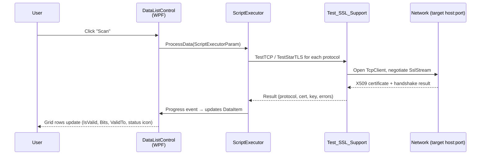
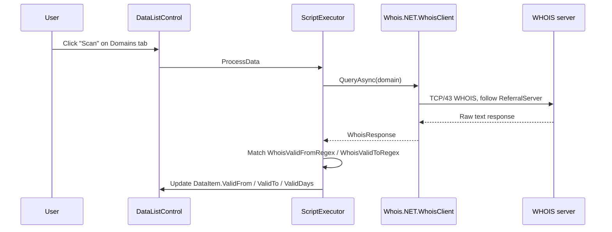
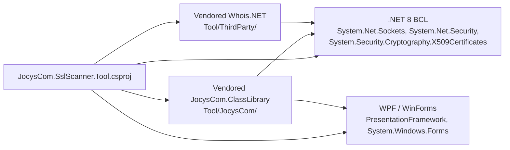

# SslScanner Repository Analysis

This document is the AI onboarding map for the **JocysCom.SslScanner** repository. It describes the codebase from architecture, developer, and product perspectives so an AI coding agent can make informed changes without re-exploring the repo on every task.

The repository is intentionally small: one .NET 8 Windows desktop tool (WPF + WinForms hybrid) that scans SSL/TLS certificate validity and WHOIS-based domain expiry across configurable host lists. There is no API, no database, no microservice split — all functionality lives in a single executable.

## Repository Snapshot

Useful for new contributors and AI agents to grasp scale and entry points quickly.

- **Repository:** `JocysCom/SslScanner` (GitHub)
- **Default branch:** `main`
- **Solution file:** `JocysCom.SslScanner.slnx` (modern slnx format)
- **Projects (1):** `Tool/JocysCom.SslScanner.Tool.csproj`
- **Primary language:** C# (C# language defaults from `Microsoft.NET.Sdk`)
- **Target framework:** `net8.0-windows`
- **Output type:** `WinExe` (Windows GUI executable)
- **Current version:** `1.1.6` (2025-05-08, per `Tool/Documents/ChangeLog.txt`)
- **License:** GNU General Public License v3.0 (`LICENSE` at repo root; embedded copy at `Tool/Documents/License.txt`)
- **Distribution:** Digitally signed ZIP published on GitHub Releases (see `Tool/Documents/App_1_Sign.ps1`).

## Product Perspective

This section helps non-technical stakeholders and AI agents understand what the tool does, who uses it, and what tasks it supports.

The SSL Scanner is a stand-alone Windows utility aimed at IT operators and network administrators who need to track certificate health across a fleet of hosts. It does two things:

1. **Certificate scan** — Connects to a list of `Host:Port` endpoints, negotiates TLS/STARTTLS, retrieves the X.509 certificate, and records protocol support (SSL 3, TLS 1.0–1.3), key size, algorithms, validity window, CN, SAN, and any policy/chain errors. Supports STARTTLS for SMTP (TCP:25), POP3 (TCP:110), and IMAP (TCP:143).
2. **Domain expiry scan** — Performs WHOIS lookups for a list of domains, parses the `Creation Date` / `Expiry Date` lines via configurable regexes, and reports remaining days until expiry.

Results are displayed in two data grids (Certificates, Domains) with colour-coded "days remaining" cells (configurable thresholds at 120 / 60 / 30 / 0 days). User-editable host lists, regex patterns, and other options persist between runs in an XML file next to the executable.

The tool ships with seed data on first launch (Google, Bing, Gmail IMAP/SMTP) so users can verify it works immediately without configuring anything.

## Technology Stack

This section lets an AI agent know the exact versions to target when adding code, packages, or build steps.

### Runtime & frameworks

| Concern | Choice | Source |
| --- | --- | --- |
| .NET runtime | **.NET 8 (`net8.0-windows`)** | `Tool/JocysCom.SslScanner.Tool.csproj` |
| UI primary | **WPF** (`<UseWPF>true</UseWPF>`) | `Tool/JocysCom.SslScanner.Tool.csproj` |
| UI auxiliary | **Windows Forms** (`<UseWindowsForms>true</UseWindowsForms>`) — used by the shared `JocysCom.ClassLibrary` controls helper | `Tool/JocysCom.SslScanner.Tool.csproj` |
| Language | C# (SDK defaults; no explicit `<LangVersion>`) | `Tool/JocysCom.SslScanner.Tool.csproj` |
| DPI | Manual P/Invoke `SetProcessDPIAware` in `App()` constructor | `Tool/App.xaml.cs` |
| Debug symbols | Embedded in `Debug` configuration (`<DebugType>embedded</DebugType>`) | `Tool/JocysCom.SslScanner.Tool.csproj` |

### NuGet packages

The csproj declares **no `<PackageReference>` items**. All shared utility code (`JocysCom.ClassLibrary.*`) is vendored under `Tool/JocysCom/` as source files. WHOIS support is vendored under `Tool/ThirdParty/` (originally derived from the `Whois.NET` package). This means:

- There is no central package management (`Directory.Packages.props`) and no `Directory.Build.props/targets`.
- The build is fully self-contained against the .NET 8 BCL and the WPF / WinForms stacks shipped with the SDK.

### Build tools & scripts

| File | Purpose |
| --- | --- |
| `Tool/JocysCom.SslScanner.Tool.csproj` `<Target Name="PreBuild">` | Runs a PowerShell snippet that writes the current UTC timestamp to `Tool/Resources/BuildDate.txt` before every build. |
| `Tool/Documents/App_1_Sign.ps1` | Authenticode signs the released executable. |
| `Cleanup_Solution.ps1` | Removes `bin/`, `obj/`, IIS Express config, and other transient files. Useful when build state gets confused. |

### Embedded resources

These files are embedded into the executable and read via `Assembly.GetManifestResourceStream(...)`:

- `Tool/Documents/ChangeLog.txt` — version history surfaced in the About tab.
- `Tool/Documents/License.txt` — GPL v3 text surfaced in the About tab.
- `Tool/Resources/BuildDate.txt` — produced by the PreBuild target.

## Solution & Folder Layout

This section gives a deterministic map an AI agent can use to locate code without searching.

```text
JocysCom.SslScanner.slnx            Modern solution file (single project)
LICENSE                             GPL v3 license text (repo root)
README.md                           Product description + download link + screenshots
Cleanup_Solution.ps1                Removes bin/obj/IDE state
.gitignore                          Standard .NET ignore list
Tool/
├── JocysCom.SslScanner.Tool.csproj WPF + WinForms WinExe; embeds ChangeLog/License/BuildDate
├── App.xaml / App.xaml.cs          Application entry; sets DPI awareness via P/Invoke
├── MainWindow.xaml / .xaml.cs      Top-level window: tabs for Certificates / Domains / Options / About
├── AssemblyInfo.cs                 Theme + UI culture attributes
├── App.ico                         Window/exe icon
├── Common/                         Domain model & app shell glue
│   ├── AppData.cs                  Settings root (Certificates, Domains, Whois regexes)
│   ├── AppHelper.cs                Import helpers (hosts file, dedupe, CSV)
│   ├── DataItem.cs                 Row model for both Certificates and Domains tabs
│   ├── DataItemType.cs             Enum: None | Certificates | Domains
│   ├── Global.cs                   Static access to AppData<T> + AppSettings (first item)
│   ├── NativeMethods.cs            Win32 P/Invoke surface
│   ├── ScriptExecutor.cs           Runs the actual TLS / WHOIS work, reports progress
│   ├── ScriptExecutorParam.cs      Parameter bag for ScriptExecutor
│   └── Test_SSL_Support.cs         Low-level TLS probe (TestTCP + TestStarTLS)
├── Controls/                       WPF user controls bound to the data grids
│   ├── AboutControl.xaml/.cs       Reads embedded ChangeLog/License/BuildDate
│   ├── DataListControl.xaml/.cs    Reusable grid bound by DataType (Certificates|Domains)
│   └── OptionsControl.xaml/.cs     Tuning knobs (Whois regexes, etc.)
├── Documents/                      Embedded resources + signing/screenshot assets
│   ├── ChangeLog.txt               (embedded)
│   ├── License.txt                 (embedded)
│   ├── App_1_Sign.ps1              Authenticode signing script
│   └── Images/                     PNGs used in README
├── Resources/                      Generated at build time
│   └── BuildDate.txt               (embedded; PreBuild target writes it)
├── Resources/Icons/                XAML resource dictionaries for icons
├── JocysCom/                       Vendored JocysCom.ClassLibrary source (subset)
└── ThirdParty/                     Vendored Whois.NET + IP range helpers
```

There are **no test projects**, **no CI workflow files** (no `.github/workflows/`), and **no build server configuration** in this repository — releases are built and signed manually using `App_1_Sign.ps1`.

## Architecture

This section captures the layering and runtime flow so an AI agent can reason about where new behaviour belongs.

### Layered view

```mermaid
flowchart TB
    UI[WPF UI<br/>MainWindow + UserControls<br/>Tool/MainWindow.xaml, Tool/Controls/]
    APP[App shell + settings<br/>App.xaml.cs, Global.cs, AppData.cs]
    DOMAIN[Domain model<br/>DataItem, DataItemType, SortableBindingList&lt;T&gt;]
    EXEC[Scan engine<br/>ScriptExecutor, ScriptExecutorParam, Test_SSL_Support]
    THIRD[Vendored libs<br/>JocysCom.ClassLibrary &#40;Tool/JocysCom/&#41;<br/>Whois.NET &#40;Tool/ThirdParty/&#41;]

    UI --> APP
    UI --> DOMAIN
    UI --> EXEC
    EXEC --> DOMAIN
    EXEC --> THIRD
    APP --> THIRD
    DOMAIN --> THIRD
```



### Runtime flow — certificate scan



### Runtime flow — domain WHOIS scan



### Key patterns and conventions

- **Single static settings entry point.** `Global.AppData` is a `SettingsData<AppData>` (XML-persisted). `Global.AppSettings` returns the first `AppData` item — code should access settings through `Global.AppSettings`, never construct a new one.
- **Settings persistence.** XML file is named `{exeName}.xml` and lives beside the executable. Wiring is in `MainWindow.MainWindow()`.
- **Notify-property-changed.** Both `AppData` and `DataItem` implement `INotifyPropertyChanged`; setters route through `SetProperty(ref _field, value)` with `[CallerMemberName]`. Always preserve this pattern when adding properties — the WPF grids depend on it.
- **Sortable, bindable collections.** Lists use `JocysCom.ClassLibrary.ComponentModel.SortableBindingList<T>` (vendored, not BindingList<T>).
- **Reusable `DataListControl`** is parametrised by a `DataType` attribute (`Certificates` or `Domains`) and binds to the matching `AppSettings.Certificates` or `AppSettings.Domains` collection.
- **Embedded resources, not file I/O.** `ChangeLog`, `License`, and `BuildDate` are read via assembly manifest, not the filesystem — keeps the EXE self-contained.
- **No DI container.** Components are wired by direct construction / static references. Resist introducing one unless asked.
- **No async/await coordinator.** Long-running TLS / WHOIS work runs from `ScriptExecutor.ProcessData(...)` as `Task`s with progress events; the UI marshals back via `JocysCom.ClassLibrary.Controls.ControlsHelper`.

## Domain model

This section is the canonical list of fields an AI agent must respect when serialising, displaying, or filtering scan results.

### `DataItem` (`Tool/Common/DataItem.cs`)

Used by both Certificates and Domains grids. Fields:

| Group | Properties |
| --- | --- |
| Identity | `Environment`, `Group`, `Host`, `IPv4`, `IPv6`, `Port` |
| Status | `IsChecked` (XML-ignored UI flag), `IsValid` (nullable), `ResponseStatus`, `StatusCode` (`MessageBoxImage`), `StatusText`, `IsActive`, `Date` |
| TLS / cert | `PublicKeyData`, `Bits`, `SecurityProtocols` (`SslProtocols?`, serialised as int via `SecurityProtocolsValue`), `SupportSsl3`/`SupportTls`/`SupportTls11`/`SupportTls12`/`SupportTls13` (read-only flags), `Algorithm`, `CN`, `SAN`, `ValidFrom`, `ValidTo`, `ValidDays` |
| WHOIS | `WhoisData` (raw response), `Notes`, `HelpLink` |

Note the explicit XML-serialiser indirection: `SecurityProtocols` is `[XmlIgnore]` (the runtime type uses an obsolete enum value); the persisted property is `SecurityProtocolsValue` (`int?`). When extending TLS flags, follow the same `[XmlIgnore]` + `*Specified` companion-property idiom that already exists.

### `AppData` (`Tool/Common/AppData.cs`)

Root settings object. Holds:

- `Certificates : SortableBindingList<DataItem>`
- `Domains : SortableBindingList<DataItem>`
- `WhoisValidFromRegex` (default: `(Creation Date|Registered):\s*(?<Value>[^\s]+)`)
- `WhoisValidToRegex` (default: `(Expiry Date|Expiration Date|Expires):\s*(?<Value>[^\s]+)`)

The named capture group `(?<Value>...)` is contractual — `ScriptExecutor` reads `match.Groups["Value"]`.

## Seed data and first-run behaviour

On first launch (when `AppData.Items` is empty) `MainWindow` seeds:

**Certificates (6 entries)** — `www.google.com:443`, `google.com:443`, `www.bing.com:443`, `bing.com:443`, `imap.gmail.com:993`, `smtp.gmail.com:465` (all in environment "Live", group "Web").

**Domains (2 entries)** — `google.com`, `bing.com` (environment "Live", group "Web").

Settings persist on window close (`Window_Closed` → `Global.AppData.Save()`).

## Build, Run & Test

This section tells an AI agent the exact commands to use; the project has no CI infrastructure to copy from.

### Build

```pwsh
# From repo root, in PowerShell on Windows
dotnet build .\JocysCom.SslScanner.slnx -c Debug
# or for the release configuration that ships
dotnet build .\JocysCom.SslScanner.slnx -c Release
```

The PreBuild target requires PowerShell (`PowerShell.exe`) in `PATH`. Cross-compiling on non-Windows hosts is not supported (`net8.0-windows` + WPF).

### Run

```pwsh
dotnet run --project .\Tool\JocysCom.SslScanner.Tool.csproj
```

### Publish (single-file, signed)

The release artifact is published as a single-file Windows executable. Signing is via `Tool/Documents/App_1_Sign.ps1` (requires an Authenticode cert on the signing machine).

### Tests

**There are no automated tests in this repository.** No test project, no test runner configuration. Changes should be validated manually by:

1. Running the tool against the seeded host list.
2. Confirming the Certificates grid populates `ValidFrom`, `ValidTo`, `Bits`, and the TLS-flag columns.
3. Confirming the Domains grid populates `ValidFrom` / `ValidTo` from a real WHOIS lookup.
4. Confirming colour-coded "days remaining" cells reflect `< 120 / 60 / 30 / 0` thresholds.

When introducing logic that warrants tests, prefer a new `Tool.Tests/` MSTest project sibling to `Tool/` rather than adding tests into the application project.

## Documentation map

This section helps an AI agent answer "where is this documented?" without searching.

| Topic | File |
| --- | --- |
| Product overview, download link, screenshots | `README.md` |
| Version history (also embedded in EXE) | `Tool/Documents/ChangeLog.txt` |
| License (full GPL v3 text) | `LICENSE` (repo root) and `Tool/Documents/License.txt` (embedded) |
| Code-signing recipe | `Tool/Documents/App_1_Sign.ps1` |
| Workspace cleanup recipe | `Cleanup_Solution.ps1` |
| AI onboarding bundle (this file + siblings) | `.ai/` directory |

## Dependency view

The diagram below shows what each layer depends on. Arrows point from consumer to dependency.



There are no external NuGet dependencies declared in the csproj.

## Conventions for AI agents

- Match the file-scoped tab/CRLF style of existing C# files (the project uses tabs and CRLF for `.cs`/`.xaml`).
- Keep the `Global.AppData` + `Global.AppSettings` access pattern intact. Do not introduce a new singleton or DI container.
- Do not duplicate WHOIS or TLS-probe logic — extend `ScriptExecutor` / `Test_SSL_Support` instead.
- Treat `Tool/JocysCom/` and `Tool/ThirdParty/` as vendored: do not refactor public APIs there unless the change is being upstreamed simultaneously to the source libraries.
- Update `Tool/Documents/ChangeLog.txt` on every shipped release; that file is embedded and surfaced to users in the About tab.
- The PreBuild target produces `Tool/Resources/BuildDate.txt`. Do not commit that file — it is regenerated each build and `.gitignore` covers it.
- No telemetry, analytics, or auto-update channel exists; do not add one without explicit approval.
