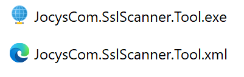
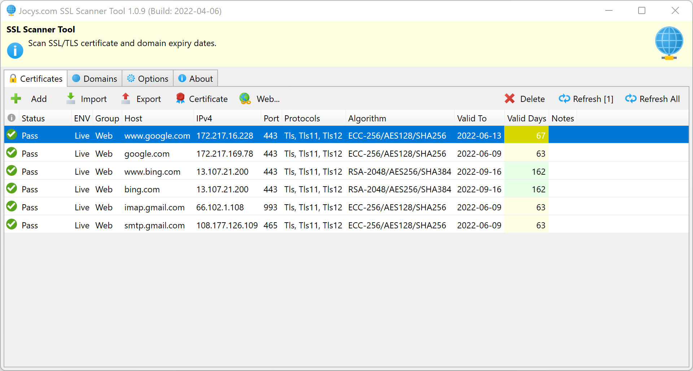
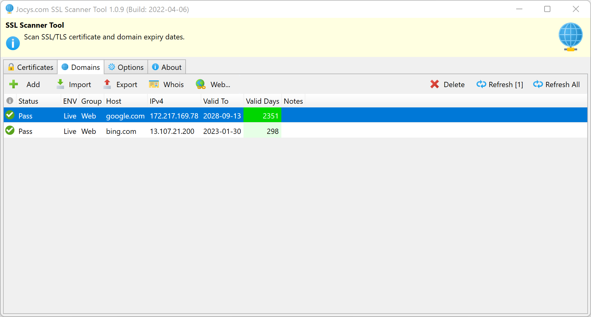

# Jocys.com SSL Scanner Tool

Scan SSL/TLS certificate and domain expiry dates. Support STARTLS protocol: SMTP (TCP:25), POP3 (TCP:110) and IMAP (TCP:143).

# Download

Digitally Signed Application v1.0.10.0 (2022-04-07)

[Download - JocysCom.SslScanner.Tool.zip](https://github.com/JocysCom/SslScanner/releases/download/1.0.0.0/JocysCom.SslScanner.Tool.zip)

## Files

One executable and one matching auto-created configuration file:

Note: Executable tries to load config from the XML file with the same name.

## Screenshots

                                                                                                               

